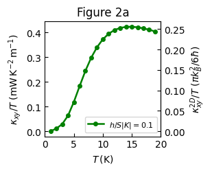
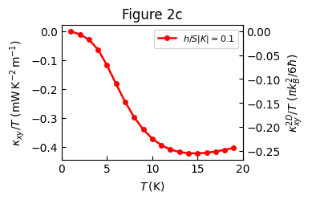
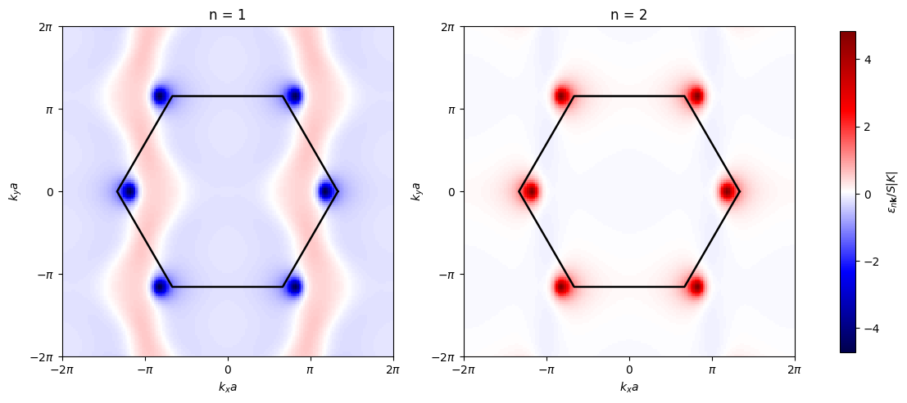

# Thermal Hall Effect of Topological Magnons in Kitaev Honeycomb

Reproducing main figures from:

Li Ern Chern, Emily Z. Zhang, and Yong Baek Kim, "Sign Structure of Thermal Hall Conductivity and Topological Magnons for In-Plane Field Polarized Kitaev Magnets," *Physical Review Letters* **126**, 147201 (2021). https://doi.org/10.1103/PhysRevLett.126.147201

The notebook that generates the plots is `main.ipynb`. Implementation of all physics calculations (Berry curvature, Thermal Hall conductivity, dispersion relation, etc... ) in `Magnons.py`.   

Figures are in the `./figures` directory. 

## Examples of Figures

   . 

Figures 2(a) and 2(c) reproduced: $\kappa_xy/T$ vs temperature for field along $\pm$, respectively. 

Figure 3(b) reproduction: Berry curvature in the a-polarized state.

